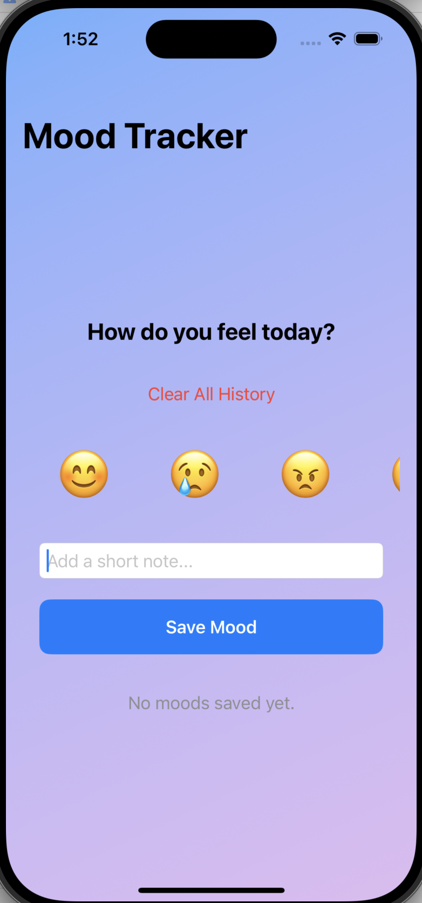
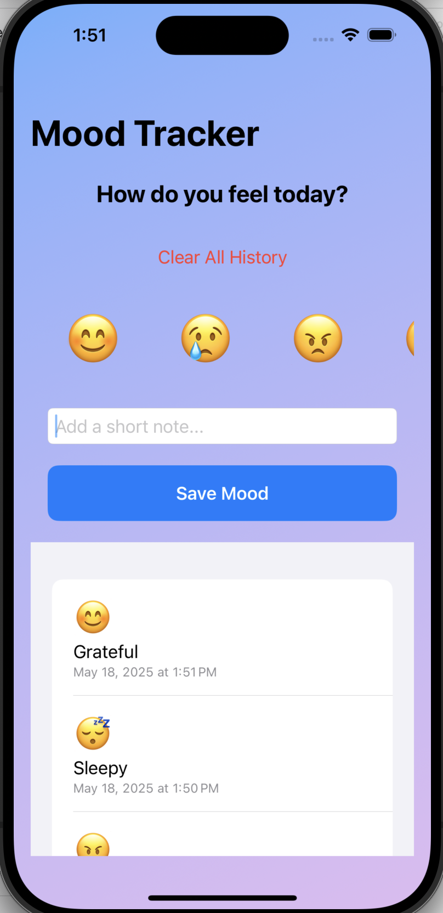

# 🧠 MoodTracker

**MoodTracker** is a simple and beautiful iOS app built using **SwiftUI** that allows users to record and reflect on their emotional state each day. The app offers emoji-based mood selection, optional note-taking, and a mood history to help visualize emotional patterns over time.

---

## ✨ Features

- 🎭 Choose your daily mood using emojis
- 📝 Add a short note or message to describe your feelings
- 📜 View mood history with timestamps
- 🧹 Clear all saved mood entries
- 🎨 Smooth gradient UI with modern SwiftUI design

---

## 📱 Screenshots

| Mood Entry | Mood History |
|------------|--------------|
|  |  |

---

## 🧑‍💻 Tech Stack

- **Language:** Swift
- **Framework:** SwiftUI
- **Data Handling:** `@State`, `@StateObject`
- **UI Components:** NavigationView, VStack, Buttons, Emojis, Custom Lists

---

## 📦 Installation

1. Clone the repository  
   ```bash
   git clone https://github.com/Mahtam94/MoodTracker.git
